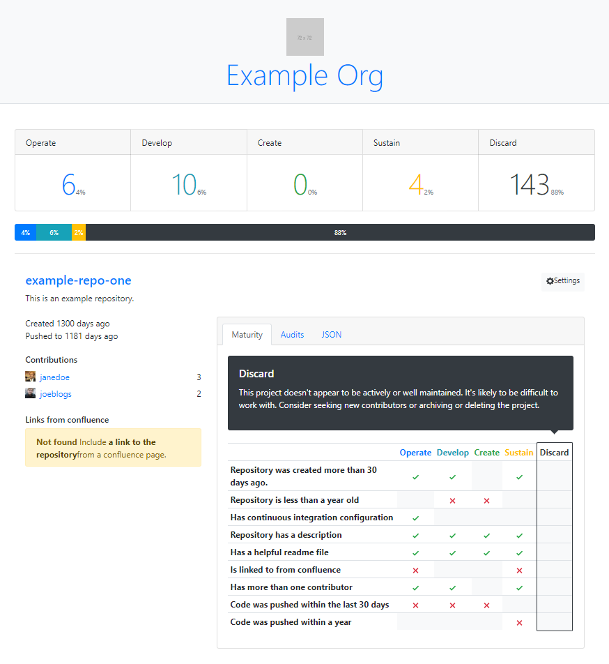

# Repository Report
Automated maturity model classification for code repositories



## Installation
```
$ npm install
```

## Usage
Currently only github is supported. although integration with other version
control systems like gitLab or BitBucket should be feasible.

### Github Integration
To communicate with github the service needs to sign requests using the AppID
and private key that was generated when the application is registered with
github.
- Set the `GITHUB_APPID` environment variable
- Save the private key file as `/.keys/github-private-key.pem`

### Running locally
#### Config
Create a `.env` file with the following format `GITHUB_APPID=xxxx` (where `xxxx`
is your registered app id)

#### Run
```
$ npm start
```
### Running in Docker

#### Build the docker image
```
$ docker build -t github-tech-report:latest .
```

#### Run the image
Mount the public key file under `/home/app/.keys`
```
$ docker run github-tech-report
```

## Contributing
Pull requests are very welcome from anyone.
